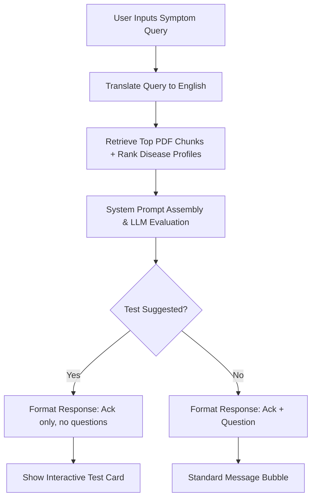

# ManasMitra: Clinical Pre-screening Assistant Project Documentation

This document provides a comprehensive overview of the **ManasMitra** pre-screening system, detailing its tech stack, architecture, workflow, and typical execution examples.

---

## 1. Project Overview
**ManasMitra** is an empathetic, AI-powered medical pre-screening assistant. It guides users through an intuitive, multilingual conversational interface to screen for neurodegenerative diseases and psychological well-being. Based on user-reported symptoms, it retrieves contextual medical documents, ranks suspected candidate diseases, recommends interactive clinical tests, and compiles a final printable clinical summary report.

---

## 2. Tech Stack

### Backend (API & Orchestration)
* **Language**: Python 3.10+
* **Framework**: FastAPI (runs on port `8000`)
* **LLM Engine**: Groq SDK (`llama-3.3-70b-versatile` for pre-screening reasoning, `llama-3.1-8b-instant` for translation and title generation)
* **Database**: SQLite3 (`db.sqlite3` with `threads` and `messages` tables)
* **Context Parsing**: PyPDF (`PdfReader`) to read and chunk clinical guides on startup.
* **Vector/Search Retrieval**: Custom Python TF-IDF engine for keyword overlap ranking and document page matching (RAG).

### Frontend (User Interface)
* **Framework**: React.js (built with Vite, runs on port `5173`)
* **Styling**: Vanilla CSS utilizing custom properties (variables) for dynamic Theme switching (Light/Dark toggles).
* **Interactivity**:
  * Native HTML5 Canvas API (for freehand drawing in the Motor Spiral Tracing Test).
  * Inline SVG elements (for the analog Clock Drawing Test hands rendering).
  * Web Speech API:
    * `SpeechSynthesis` (Text-to-Speech voices matching locales).
    * `webkitSpeechRecognition` (Speech-to-Text inputs in chat and recall fields).

---

## 3. System Architecture

```
[User Browser / Frontend React]
       │
       ├─► Web Speech API (STT / TTS)
       ├─► SVG/Canvas Clinical Modals
       │
       ▼ (REST API)
[FastAPI Backend / main.py]
       │
       ├─► SQLite3 (History persistence)
       ├─► PDF Chunks (Local reference guides)
       │
       ▼ (Groq API Connection)
[Groq Cloud / Llama 3]
```

### Database Schema
* **`threads`**: Stores conversation sessions.
  * `id` (TEXT, PRIMARY KEY): Unique UUID.
  * `title` (TEXT): Dynamic summary title (auto-generated from first message).
  * `created_at` (TIMESTAMP).
* **`messages`**: Stores message logs for each thread.
  * `id` (INTEGER, PRIMARY KEY AUTOINCREMENT).
  * `thread_id` (TEXT, FOREIGN KEY).
  * `role` (TEXT): `user`, `assistant`, or hidden `SYSTEM` tags.
  * `content` (TEXT): Text content (or JSON system payload).
  * `created_at` (TIMESTAMP).

---

## 4. Operational Workflow



### A. Pre-screening Loop
1. **Query Processing**: User submits symptoms in their native language (e.g. Hindi, Spanish).
2. **Translation Layer**: The backend translates the input query to English for internal matching.
3. **Retrieval (RAG)**: The TF-IDF scorer matches terms against chunked PDFs and disease profiles, extracting the top candidates.
4. **LLM Completion**: Groq generates a response matching the user's language.
   * If a clinical activity (e.g. Motor, FAQ) is recommended, the backend strips out all follow-up questions from the response and renders a dedicated activity card.
5. **Activity Testing**: The user completes the interactive modal, sending a `SYSTEM:` result payload back to the chat.
6. **Completion & Reporting**: After the main criteria are explored (typically 8+ conversation turns), the chatbot marks the session complete, displaying an inline **Generate Report** action card.

---

## 5. Clinical Activities Details

| Activity | Clinical Target | Interactive Implementation | Scoring Rules |
| :--- | :--- | :--- | :--- |
| **Motor Stability** | Coord. / Tremors | Mouse/touch canvas spiral tracing. | Jitter speed deviation (Stability index out of 100%). |
| **Cognitive Memory** | Attention / Recall | 5-digit recall span with distractor arithmetic. | Reverse digit sequence comparison (Recall accuracy %). |
| **Word Recognition** | Short-term Memory | Shuffled 8-word memory grid selectors. | Correct hits minus false distractors (Accuracy %). |
| **Clock Drawing** | Visuospatial skills | Draggable analog clock hands (SVG face). | Hand angle deviation from target **10:00** time. |
| **FAQ Questionnaire**| IADL Independence | 10-step wizard for everyday functions. | Score sum (0-30); total $\ge 9$ indicates impairment. |

---

## 6. Execution Example (Multilingual Session)

1. **User input (Hindi)**: *"मेरे हाथ काफी कांप रहे हैं और मुझे चलने में दिक्कत है।"*
2. **Translation**: *"My hands are shaking a lot and I have trouble walking."*
3. **Internal Candidate Match**: Scores highest for **Parkinson's Disease**.
4. **Chatbot Reply (Hindi)**:
   > "मुझे यह सुनकर बहुत खेद है कि आपके हाथ कांप रहे हैं और चलने में परेशानी हो रही है।
   > 
   > लक्षणों का मूल्यांकन करने में सहायता के लिए, कृपया नीचे दी गई मोटर स्थिरता गतिविधि को पूरा करें।"
5. **UI Trigger**: A `"Recommended Activity: Motor Stability"` card renders inline.
6. **Activity Execution**: User traces the spiral canvas. Jitter matches *Moderate Tremor*.
7. **System Submission**:
   `SYSTEM: User completed the Motor (Spiral Tracing) test. Results: Stability Index = 65%...`
8. **Final Report**: Compiles details into a printable clinical report outline with diagnostic warnings.
